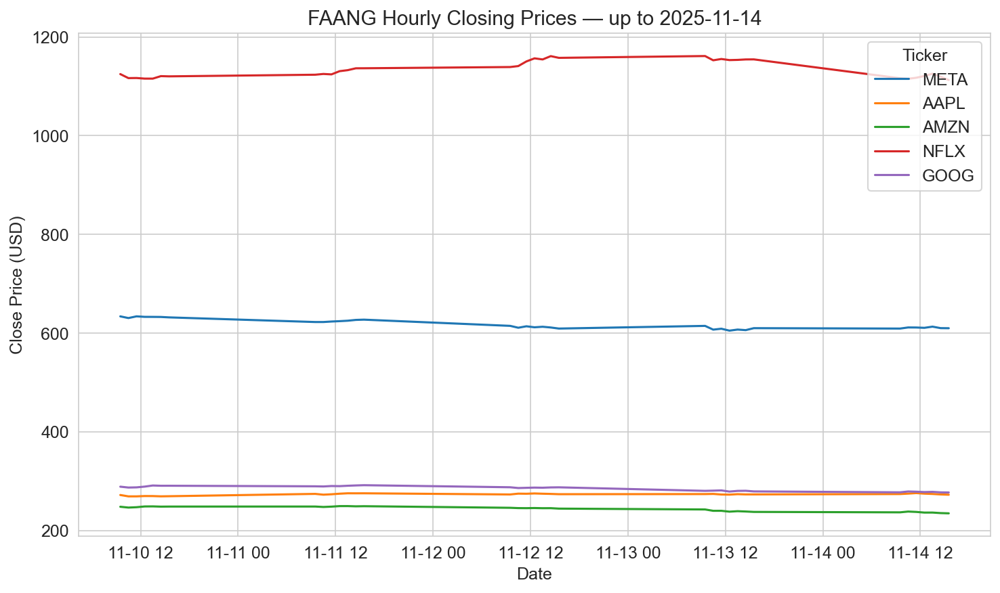

# 📘 FAANG Stock Analysis — Assessment Notebook

**Author:** Edward Cronin  
**Student ID:** g00425645  
**Email:** g00425645@atu.ie  
**GitHub:** [ECronin1973](https://github.com/ECronin1973/computer_infrastructure/tree/main)  
**Module:** Higher Diploma in Data Analytics, ATU Galway (Winter 2025–2026)  

---

## 📑 Table of Contents
1. [Background](#background)  
2. [Repository Setup](#repository-setup)  
3. [Environment Setup](#environment-setup)  
4. [Included Files](#included-files)  
5. [Accessing Market Data with yfinance](#accessing-market-data-with-yfinance)  
6. [Helper Functions and Modular Design](#helper-functions-and-modular-design)  
7. [Problem 1: Fetch Hourly FAANG Data](#problem-1-fetch-hourly-faang-data)  
8. [Problem 2: Plotting Data](#problem-2-plotting-data)  
9. [Problem 3: Script Creation](#problem-3-script-creation)  
10. [Problem 4: Automation with GitHub Actions](#problem-4-automation-with-github-actions)  
11. [Analysis](#analysis)  
12. [Reviewer Checklist](#reviewer-checklist)  
13. [Personal Reflection](#personal-reflection)  

---

## 📚 Background

This notebook supports the [Computer Infrastructure module assessment](https://github.com/ianmcloughlin/computer-infrastructure/blob/main/assessment/problems.md) for ATU Winter 2025–2026. It focuses on collecting and visualising hourly stock data for the FAANG companies — Meta (META), Apple (AAPL), Amazon (AMZN), Netflix (NFLX), and Alphabet (GOOG) — using Python tools such as `yfinance`, `pandas`, `matplotlib`, and `seaborn`.

The project is divided into four problems:
- Problem 1: Fetch and save hourly data  
- Problem 2: Plot closing prices  
- Problem 3: Convert logic into a CLI script  
- Problem 4: Automate execution using GitHub Actions  

---

## 📥 Download Repository

To download and explore the repository:

```bash
git clone https://github.com/ECronin1973/computer_infrastructure.git
cd computer_infrastructure
```

After cloning, you can either:
- Run the notebook (problems.ipynb) step by step in Jupyter.
- Execute the script directly with ./faang.py to fetch data and generate plots automatically.
- outputs are automatically saved logically into data/ and plots/ folders.

### 📁 Included Files

- [problems.ipynb](https://github.com/ECronin1973/computer_infrastructure/blob/main/problems.ipynb) — Interactive notebook with modular steps for each problem
- [faang.py](https://github.com/ECronin1973/computer_infrastructure/blob/main/faang.py) — CLI script with mirrored logic from the notebook
- data/ — Folder for saved timestamped CSV files
- plots/ — Folder for saved timestamped PNG plots
- [requirements.txt](https://github.com/ECronin1973/computer_infrastructure/blob/main/requirements.txt) — Python dependencies

---

## 🔧 Environment Setup

To run the notebook and script successfully, choose one of the following setup options:

### 🧭 Option 1: GitHub Codespaces (Recommended)

1. Open the repository in Codespaces → GitHub → Code dropdown → Codespaces → Create codespace on main

2. Install required packages

```bash
pip install -r requirements.txt
```

3. Check file permissions

```bash
ls -l
```

4. Make scripts executable (if needed)

```bash
chmod +x faang.py
```

5. Run the notebook or script

```bash
jupyter notebook problems.ipynb
./faang.py
```

**note:** the script automatically saves CSV's and plots appropriately into data/ and plots/ folders.

📖 Reference: [GitHub Codespaces Overview](https://docs.github.com/en/codespaces/quickstart)

### 🧭 Option 2: Local Python Environment

1. Install Python 3.10+ 

📖 [Installing Python — Real Python](https://realpython.com/installing-python/)

2. Create and activate a virtual environment

```bash
python -m venv venv
source venv/bin/activate  # Windows: venv\Scripts\activate
```
3. Install dependencies

```bash
pip install -r requirements.txt
```

4. Make scripts executable (if needed)

```bash
chmod +x faang.py
```

5. Run the notebook or script

```bash
jupyter notebook problems.ipynb
./faang.py
```
📖 References:

[Python Virtual Environments — Real Python](https://realpython.com/python-virtual-environments-a-primer/).  
*This shows how to create and manage virtual environments for Python projects.*

[chmod Command — GeeksforGeeks](https://www.geeksforgeeks.org/chmod-command-in-linux-with-examples/).  *This explains how to use the chmod command to change file permissions in Unix-like operating systems.*

---

## 📚 Background: Accessing Market Data with yfinance

This project uses [`yfinance`](https://github.com/ranaroussi/yfinance) to retrieve hourly OHLCV data from Yahoo Finance.

### Why yfinance?
- No API key required  
- Supports hourly and daily intervals  
- Returns pandas-compatible DataFrames  
- Ideal for exploratory analysis and educational use  

📖 Reference: [yfinance documentation](https://pypi.org/project/yfinance/)

> ⚠️ Note: `yfinance` is not affiliated with or endorsed by Yahoo Inc. Use it only for educational or research purposes.

### 🔍 Clarification on “Close”
- In this project, the **Close** column represents the **hourly closing price** at the end of each trading interval, not the single consolidated daily close.  
- On weekdays when markets are open, the program captures hourly closes intraday.  
- On weekends or holidays, no new hourly data is available, so the latest file stops at the **final close of the last trading session** (e.g., Friday’s market close).  
- Plot titles are updated to show *“FAANG Hourly Closing Prices — up to YYYY‑MM‑DD”*, where the date corresponds to the last available data point in the dataset.
- According to [Medium Article on yfinance Close Prices](https://medium.com/@josue.monte/why-adj-close-disappeared-in-yfinance-and-how-to-adapt-6baebf1939f6) - When working with historical stock data, using adjusted prices is essential for accurate analysis. The auto_adjust parameter in yfinance makes this easy by automatically adjusting prices for splits and dividends.

---

## 🎯 Target Audience

This repository is designed for computing students and professionals with intermediate Python skills ([Real Python](https://realpython.com/intermediate-python/)). Familiarity with pandas ([docs](https://pandas.pydata.org/docs/)), matplotlib ([docs](https://matplotlib.org/stable/users/index.html)), and basic CLI usage ([Real Python CLI Guide](https://realpython.com/ref/stdlib/argparse/)) is recommended. The notebook includes environment checks, helper functions, and modular steps ([Real Python Modules](https://realpython.com/python-modules-packages/)) to support reproducibility and automation.

**note** the notebook is designed to be **reviewer-friendly**, with clear sections, comments, and references to facilitate understanding and assessment.

---

## 🧰 Helper Functions and Modular Design

This project uses a set of modular helper functions defined directly within the notebook (`problems.ipynb`) and script (`faang.py`). While these functions are not stored in a separate helper file (like `utils.py`), they are structured and reused in a way that mirrors the benefits of a modular helper module.

By adapting the logic into reusable functions within the main files, the project maintains clean separation of concerns, avoids code duplication, and supports both interactive and automated workflows — all without requiring external imports.

### 🔧 Functions Used in This Project

The following helper functions are defined in the notebook (`problems.ipynb`).  
Additional functions, such as `plot_close_prices(data, output_dir)`, are implemented in the script (`faang.py`) to package the plotting logic for automation.

| Function | Purpose | Benefit | Reference |
|----------|---------|---------|-----------|
| `verify_environment(show_preview=True)` | Tests `yfinance` connectivity and optionally previews sample data. | Confirms the environment is ready before running the full workflow. | [yfinance Quickstart](https://pypi.org/project/yfinance/) |
| `fetch_hourly_history(ticker)` | Retrieves 5 days of hourly OHLCV data for a single ticker. | Provides clean, labeled data for each FAANG stock. | [yfinance.Ticker.history](https://github.com/ranaroussi/yfinance) |
| `save_hourly_data(tickers, output_dir, overwrite=False)` | Combines hourly data for multiple tickers and saves it to a timestamped CSV. | Enables reproducibility and version control of data outputs. | [pandas.DataFrame.to_csv](https://pandas.pydata.org/docs/reference/api/pandas.DataFrame.to_csv.html) |
| `load_latest_data(tickers, folder='data', show_preview=True)` | Loads the most recent CSV and splits it into separate DataFrames per ticker. | Supports targeted analysis and plotting by company. | [pandas.read_csv](https://pandas.pydata.org/docs/reference/api/pandas.read_csv.html) |

> ℹ️ **Note:** The plotting function `plot_close_prices(data, output_dir)` is implemented in the script (`faang.py`) rather than the notebook. In the notebook, Step 7 performs plotting inline.

---

### 🧠 Why This Matters

Although these functions are embedded within the main files rather than extracted into a standalone helper module, they are designed with the same principles in mind:

- ✅ **Reusability** – Functions are called multiple times across notebook and script, reducing duplication.  
- ✅ **Readability** – Each function has a clear, single responsibility, supported by concise docstrings (engineering contract style).  
- ✅ **Maintainability** – Logic is easy to update without affecting unrelated parts, ensuring long‑term usability.  
- ✅ **Scalability** – Functions can be moved to a helper file later if needed, without breaking the workflow.  
- ✅ **Reviewer Transparency** – Modular design and inline documentation make it clear how each step fulfils the assignment requirements (Problems 1–3).  
- ✅ **Consistency** – Notebook and script mirror each other, ensuring reproducibility whether run interactively or via CLI.  

#### 📖 References  
- [Real Python – Python Modules and Packages](https://realpython.com/python-modules-packages/)  
- [GeeksforGeeks – Python Helper Functions](https://www.geeksforgeeks.org/python-helper-functions/)  
- [Wikipedia – DRY Principle](https://en.wikipedia.org/wiki/Don%27t_repeat_yourself)  
- [pandas Documentation](https://pandas.pydata.org/docs/)  
- [matplotlib Documentation](https://matplotlib.org/stable/api/pyplot_summary.html)  
- [seaborn Documentation](https://seaborn.pydata.org)  

---

## 🧪 Problem 1: Fetch Hourly FAANG Data

### 🎯 Objective
Use the `yfinance` package to fetch **5 days of hourly OHLCV data** for the FAANG tickers and save the results to a timestamped CSV file.  
This fulfils the **Problem 1 requirement** of the assessment.

### ⚙️ Workflow
- Define and validate the FAANG ticker list (`META`, `AAPL`, `AMZN`, `NFLX`, `GOOG`).  
- Use `fetch_hourly_history()` to retrieve hourly OHLCV data via `yfinance.Ticker.history`.  
- Label each DataFrame with a `Ticker` column and clean the index (`Date`).  
- Concatenate all ticker DataFrames into one combined dataset.  
- Save the dataset to `data/YYYYMMDD-HHMMSS.csv` using `pandas.DataFrame.to_csv`.  

### 📤 Output File
- **Format:** `data/YYYYMMDD-HHMMSS.csv`  
- **Example:** `data/20251105-220824.csv`  
- Each row includes OHLCV values plus a `Ticker` label for clarity.  
- Filenames are timestamped for reproducibility and version control.  

### 🔍 Clarification on “Close”
- The **Close** column represents the **hourly closing price** at the end of each trading interval, not the single consolidated daily close.  
- On weekends or holidays, no new hourly data is available, so the latest file stops at the **final close of the last trading session**.  
- This ensures the dataset correctly reflects the assignment requirement for hourly data.  

📖 References:  
- [yfinance.Ticker.history](https://github.com/ranaroussi/yfinance)  
- [pandas.DataFrame.to_csv](https://pandas.pydata.org/docs/reference/api/pandas.DataFrame.to_csv.html)  
- [datetime Module](https://docs.python.org/3/library/datetime.html)  

---

## 📊 Problem 2: Plotting Data

### 🎯 Objective
Visualise the **hourly closing prices** of all FAANG tickers using the most recent CSV file.  
This fulfils the **Problem 2 requirement** of the assessment.

### ⚙️ Workflow
1. Load the latest CSV from the `data/` folder using `pandas.read_csv`.  
2. Plot the `Close` prices for each ticker using `matplotlib` and `seaborn`.  
3. Add axis labels (`Date`, `Close Price (USD)`), a legend for tickers, and a title showing the **last available trading date**.  
4. Save the plot to `plots/YYYYMMDD-HHMMSS.png` with a UTC timestamped filename.  

### 📤 Output File
- **Format:** `plots/YYYYMMDD-HHMMSS.png`  
- **Example:** `plots/20251105-220824.png`  
- Each plot provides a clear visual comparison of FAANG hourly closes over the last five trading days.  



### 🔍 Clarification on “Close”
- The plot shows **hourly closing prices**, not the single consolidated daily close.  
- On weekends or holidays, no new hourly data is available, so the plot stops at the **final close of the last trading session**.  
- The title reflects the **last available date in the dataset**, ensuring consistency between the plot and the underlying data.  

📖 References:  
- [pandas.read_csv](https://pandas.pydata.org/docs/reference/api/pandas.read_csv.html)  
- [matplotlib.pyplot.plot](https://matplotlib.org/stable/api/_as_gen/matplotlib.pyplot.plot.html)  
- [seaborn.set_style](https://seaborn.pydata.org/generated/seaborn.set_style.html)  

---

### 📈 Analysis (Optional)

This section goes beyond the assignment requirements to provide deeper insights into FAANG hourly closing prices. The plots are displayed inline in the notebook, not saved to .png files, so explanations are included here.

1. 📊 Raw Hourly Closing Prices

Logic:
- Load the most recent CSV with pandas.read_csv.
- Plot each ticker’s Close column against Date.
- Use matplotlib for line plots and seaborn.set_style("darkgrid") for aesthetics.

What It Shows:
- Intraday volatility across FAANG stocks.
- Different absolute price ranges (e.g., AAPL vs. GOOG).
- Title reflects the last available trading date.


2. 📊 Normalised Comparison (Indexed to 100)

Logic:
- For each ticker, divide all Close values by the first value in the 5‑day window.
- Multiply by 100 to create an index baseline.
- Plot indexed values to compare relative performance.

What It Shows:
- Relative growth/decline across tickers, independent of absolute price levels.
- Easier to see which stock outperformed or underperformed over the period.

3. 📊 Rolling Average Plot

Logic:
- Apply pandas.DataFrame.rolling(window=3).mean() to smooth hourly closes.
- Plot smoothed lines alongside raw closes.

What It Shows:
- Short‑term trends and momentum.
- Reduces noise from hourly volatility.

4. 📊 Percentage Change Plot

Logic:
- Use pandas.DataFrame.pct_change() to calculate hourly returns.
- Plot percentage changes for each ticker.

What It Shows:
- Volatility spikes (large positive/negative hourly returns).
- Comparative riskiness of each stock.

5. 🔥 Heatmap of Correlations

Logic:
- Load hourly closes into a DataFrame.
- Use pandas.DataFrame.corr() to compute correlation matrix.
- Plot with seaborn.heatmap(corr, annot=True, cmap="coolwarm").

NaN Handling:
- If missing values exist (e.g., due to market holidays or API gaps), fill them before correlation:
- df.fillna(method="ffill") (forward fill) ensures continuity by carrying forward the last valid observation.
- Alternatively, df.interpolate() can estimate missing values based on surrounding data.

Forward fill is chosen here because it preserves actual trading behaviour without introducing artificial values.

What It Shows:
- Strength of relationships between FAANG hourly closes.
- High correlations (close to 1) indicate similar movement patterns (e.g., META and GOOG).
- Lower correlations highlight more independent behaviour.

#### 🧠 Why This Matters
- Hourly vs. Daily Close: Clarifies assignment requirement and avoids confusion.
- Relative Performance: Normalisation shows comparative growth.
- Trend Analysis: Rolling averages highlight momentum.
- Volatility: Percentage change plot reveals risk.
- Market Relationships: Heatmap shows how FAANG stocks move together.
- NaN Strategy: Forward fill ensures clean, consistent datasets without distorting analysis.

---

## 🐍 Problem 3: Script Creation (`faang.py`)

### 🎯 Objective
Convert the notebook logic into a standalone Python script that can be executed from the terminal.  
This fulfils the **Problem 3 requirement** of the assessment.

### 🧾 Script: `faang.py`
The script replicates the notebook logic and supports flexible execution via command‑line flags.  
It automatically saves outputs into the `data/` and `plots/` folders with timestamped filenames.

### ✅ Features
- Fetches and saves hourly FAANG data (`save_hourly_data()`)  
- Generates and saves comparative plots (`plot_close_prices()`)  
- Supports CLI flags for flexible execution  
- Titles plots with the **last available trading date** for consistency  

### 🧩 CLI Flags
- `--plot` — Generate and save a plot after fetching data  
- `--overwrite` — Allow overwriting an existing CSV file  
- `--show` — Display the plot after saving  

📖 Reference: [argparse — CLI Argument Parsing](https://docs.python.org/3/library/argparse.html)

### 🛠️ Script Design Process
- ✅ Copied modular functions from the notebook into `faang.py`  
  📖 [Modular Functions in Python](https://realpython.com/python-modules-packages/)  

- ✅ Implemented `plot_close_prices()` in the script to package plotting logic  
  📖 [matplotlib.pyplot](https://matplotlib.org/stable/api/pyplot_summary.html), [seaborn](https://seaborn.pydata.org)  

- ✅ Integrated `argparse` to support CLI flags  
  📖 [argparse Documentation](https://docs.python.org/3/library/argparse.html)  

- ✅ Mapped notebook steps to discrete functions for clarity and reuse  
  📖 [Python Modules and Packages](https://realpython.com/python-modules-packages/)  

- ✅ Added CLI flags for flexible execution in different environments  

- ✅ Tested the script in both terminal and GitHub Codespaces environments  

- ✅ Documented usage and functionality in this README  
  📖 [Documenting Python Code](https://realpython.com/documenting-python-code/)  

---

## 🤖 Problem 4: Automation with GitHub Actions ( To Be Completed )

---

### Acknowledgements

Copilot was used to assist with code generation and suggestions throughout this project.

### Personal Reflection

They say less is more and that is certainly true when it comes to writing code.  I used copilot to help me with this assignment and found that it often produced code that was too verbose and complicated for the task at hand.  By simplifying the code and focusing on the core functionality, I was able to create a more efficient and maintainable solution.  By reviewing weekly lectures, I was able to see what was being asked in a notebook, not cells full of extremely complicated code.  I was conscious of my audience. This experience has reinforced the importance of writing clean and concise code, and I will strive to apply this principle in my future coding endeavors.  I found the feedback very useful in helping me to identify areas where I could improve my code and I set out to ensure that my final submission reflected these improvements. I spent time refining my code to enhance its clarity and efficiency, ultimately leading to I hope, a more polished final submission.

