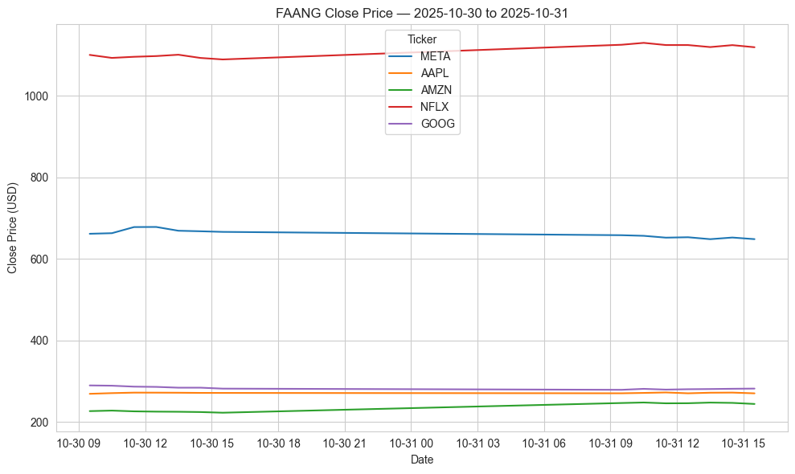

# Computer Infrastructure – Module Assessments (2025/2026)

**Author:** Edward Cronin  
**Student ID:** g00425645  
**Email:** g00425645@atu.ie  
**GitHub:** [ECronin1973](https://github.com/ECronin1973)

---

## Overview

This repository contains solutions to four practical problems from the ATU Galway Computer Infrastructure module. The primary deliverable is the interactive notebook `notebooks/problems.ipynb`, which fetches hourly FAANG stock data, saves timestamped CSVs, and produces comparison plots.

What's included:

- `notebooks/problems.ipynb` — Interactive notebook with the solutions and step-by-step runner (Steps 0–3)
- `requirements.txt` — Python package dependencies
- `README_SETUP.md` — Setup instructions for Windows PowerShell

This README is a compact companion to the notebook and documents the runtime behaviour and file conventions used by the exercises.

## How to run (quick)

- Open `notebooks/problems.ipynb` in Jupyter. Run the Setup cell, then execute the runner cells in order: Step 0 → Step 1 → Step 2 → Step 3. This will fetch data, save CSVs to `data/`, load the latest files, and produce the comparison plot in `plots/`.

## Outputs (quick summary)

- Data files currently in `data/` (examples): 5 CSVs — `AAPL_20251030-145402.csv`, `AMZN_20251030-145402.csv`, `GOOG_20251030-145402.csv`, `META_20251030-145402.csv`, `NFLX_20251030-145402.csv`.
- Plots currently in `plots/` (examples): `faang_close.png` (canonical embedding image saved by the notebook when `NO_DATE_PLOTS=True`).

## License

- Licensed under the Apache License, Version 2.0. See the repository `LICENSE` file for the full text (`./LICENSE`).
- Copyright 2025 Edward Cronin — author of `notebooks/problems.ipynb`.

## Table of contents

- [Overview](#overview)
- [License](#license)
- [Quick Start](#quick-start-windows-powershell)
- [Key configuration & filename conventions](#key-configuration--filename-conventions)
- [Problem 1 — FAANG Stock Data (summary)](#problem-1--faang-stock-data-summary)
- [Canonical Ticker List](#canonical-ticker-list)
- [Problem 2 — Plotting (summary)](#problem-2--plotting-summary)
- [Scripts & Automation (Problems 3–4)](#scripts--automation-problems-3-4)
- [Helper functions (notebook)](#helper-functions-notebook)
- [Quick verification (how to run the notebook)](#quick-verification-how-to-run-the-notebook)

---

## Quick Start (Windows PowerShell)

1. Clone the repository:

```powershell
git clone https://github.com/ECronin1973/computer_infrastructure.git
cd computer_infrastructure
```

2. Create and activate a virtual environment, then install dependencies:

```powershell
python -m venv .venv
.\.venv\Scripts\Activate.ps1
python -m pip install --upgrade pip
python -m pip install -r requirements.txt
```

3. Launch Jupyter and open the notebook:

```powershell
jupyter notebook
```

Open `notebooks/problems.ipynb` and run the cells in order. See `README_SETUP.md` for alternative environment notes.

---

## Key configuration & filename conventions

- DATA folder (default): `data/` (notebooks use `DATA_DIR = Path('../data').resolve()`)
- PLOTS folder (default): `plots/` (notebooks use `PLOTS_DIR = Path('../plots').resolve()`)
- CSV filename pattern (UTC timestamp to seconds): `TICKER_YYYYMMDD-HHmmss.csv` (example: `AAPL_20251030-142530.csv`)
- Plot filename pattern (UTC): `faang_close_YYYYMMDD-HHmmss.png` (the notebook also supports a canonical `faang_close.png` option)


Notes:

- The notebook's Step 1 writes CSVs into `data/` using UTC timestamps (to seconds) and the ticker prefix. This makes filenames lexicographically sortable by time.
- Flags in the notebook control behavior (defaults are set in the Setup cell): `NO_DATE_FILENAMES`, `SAVE_DAILY`, `OVERWRITE`, and `NO_DATE_PLOTS`.

### How the notebook selects saved CSV files (actual behaviour)

Important: the notebook's current loader implementation (the `load_latest_csvs()` helper) searches for timestamped files matching the pattern `TICKER_*.csv` and selects the most recent one by filename sort. It does not currently check for or prefer an exact `TICKER.csv` filename.

Selection strategy implemented in the notebook:

- The loader lists files in the `data/` folder that start with the ticker and end with `.csv`, using the pattern `TICKER_*.csv` (for example `AAPL_20251030-142530.csv`).
- It then sorts the matching filenames (the code sorts in reverse and picks the first item), effectively choosing the latest timestamp when filenames use the UTC `YYYYMMDD-HHmmss` format.
- The chosen file is read with `pd.read_csv(..., parse_dates=['Date'], index_col='Date')` so the `Date` column becomes a pandas DateTimeIndex for plotting and analysis.
- If no matching `TICKER_*.csv` files are found for a ticker the loader prints a warning and skips that ticker (the runner's diagnostic also shows which files were used).

Why this matters:

- Timestamped filenames using `YYYYMMDD-HHmmss` are lexicographically sortable, so "most recent" can be determined by filename alone (portable across OS and cloud sync systems).
- If you want a canonical, stable filename (e.g., `TICKER.csv`) the code must be updated to prefer that exact filename; currently the loader will ignore `TICKER.csv` unless you change the helper implementation.

Concrete pseudo-logic that matches the notebook as currently implemented:

```python
files = [p for p in os.listdir(data_folder) if p.startswith(f"{ticker}_") and p.endswith('.csv')]
if not files:
    print(f"⚠️ No saved CSV found for {ticker} in {data_folder}")
    continue
latest = sorted(files, reverse=True)[0]
path = os.path.join(data_folder, latest)
df = pd.read_csv(path, parse_dates=['Date'], index_col='Date')
```

---

## Problem 1 — FAANG Stock Data (summary)

Objective: download hourly data (5-day period, 1-hour interval) for FAANG tickers and save timestamped CSVs.

Important behaviour:

- Filenames: `TICKER_YYYYMMDD-HHmmss.csv` (UTC). Example: `AAPL_20251030-142530.csv`.
- Folder: saved to `data/` relative to the notebook (setup uses `DATA_DIR = Path('../data').resolve()`).
- Each CSV contains hourly OHLCV columns, a `Ticker` column, and an explicit `Date` column (saved as the index label so the loader can parse it using `parse_dates=['Date']`).

Robustness and reproducibility:

- The notebook includes an environment verification helper to check package availability and perform a lightweight `yfinance` request before large downloads.
- File I/O is wrapped in try/except and respects the `OVERWRITE` flag so repeated runs do not clobber files unless requested.

Output preview (first rows of a saved CSV):

```
Date,Open,High,Low,Close,Volume,Dividends,Stock Splits,Ticker
2025-10-24 09:30:00-04:00,261.19000244140625,261.6199951171875,259.17999267578125,260.94140625,7287527,0.0,0.0,AAPL
2025-10-24 10:30:00-04:00,260.94000244140625,263.3599853515625,260.7900085449219,263.2799987792969,5490920,0.0,0.0,AAPL
2025-10-24 11:30:00-04:00,263.2900085449219,264.0299987792969,262.95001220703125,263.5799865722656,4458666,0.0,0.0,AAPL
```

Notes:

- The `Date` values are timezone-aware (you may see offsets like `-04:00`) — the loader reads them with `parse_dates=['Date']` and `index_col='Date'` so pandas preserves timezone information in the resulting DateTimeIndex.
- Saved CSVs from `yfinance` often include extra metadata columns such as `Dividends` and `Stock Splits` in addition to the OHLCV columns and `Ticker`.

## Canonical Ticker List

The notebook uses a canonical list of FAANG tickers: ['META', 'AAPL', 'AMZN', 'NFLX', 'GOOG'], deduplicated using a helper function.

### 🔍 What’s Next in Problem 1

After defining the ticker list, Problem 1 walks through the full data acquisition pipeline:

- ✅ **Environment verification**: Confirms required packages and yfinance access.
- 🧪 **Smoke test**: Fetches a small sample of AAPL data to validate setup.
- 💾 **Fetch & Save**: Downloads hourly data for each ticker and saves timestamped CSVs to `data/`.
- 📂 **Load & Preview**: Loads the most recent CSV for each ticker into memory and displays a preview.

Each step is modular and uses helper functions to ensure clean logic, reproducibility, and defensive programming.


References for Problem 1:

- yfinance: https://pypi.org/project/yfinance/
- pandas.to_csv / read_csv (parse_dates): https://pandas.pydata.org/

---

## Problem 2 — Plotting (summary)

**Objective:** Load the latest saved CSV for each ticker and plot Close prices on a single chart.

**Behavior:**
- The `load_latest_csvs()` helper selects the most recent file for each ticker using lexicographic sort (timestamped filenames in `YYYYMMDD-HHmmss` format).
- The plot displays all five Close price series on a shared timeline.
- Axis labels, a legend, and a date-range title are included for clarity.
- Plot files are saved to `plots/` using the format `faang_close_YYYYMMDD-HHmmss.png` (UTC).
- The notebook supports a stable filename `faang_close.png` when `NO_DATE_PLOTS = True`, useful for README embedding.

**References:**
- [matplotlib](https://matplotlib.org/)
- [pandas timeseries guide](https://pandas.pydata.org/docs/user_guide/timeseries.html)

**Output (example):**

View the generated comparison plot (saved in `plots/`):



You can also open the file directly at `plots/faang_close.png` to inspect the saved image.

---

## Scripts & Automation (Problems 3–4)

- Problem 3 suggests packaging the helper functions into a CLI script `faang.py` (root) that performs the same steps as the notebook when run from the terminal.
- Problem 4 suggests a GitHub Actions workflow to run the script weekly (example schedule: every Saturday morning). Place workflows in `.github/workflows/faang.yml`.

---

## Helper functions (notebook)

The notebook contains small, focused helper functions that make the workflow reproducible and testable. Examples:

- `verify_environment()` — checks package availability and tests a sample `yfinance` request
- `install_requirements_if_missing()` — installs packages from `requirements.txt` if missing
- `deduplicate_preserve_order(seq)` — removes duplicates while preserving input order
- `fetch_hourly_history(ticker, period='5d', interval='1h')` — returns hourly stock DataFrame or `None`
- `save_hourly_data(ticker, folder='../data')` — fetches and saves hourly stock data to timestamped CSVs
- `load_latest_csvs(tickers, folder='../data')` — loads the latest CSV per ticker into a dictionary of DataFrames
- `preview_dataframe(df)` — prints shape and head of a DataFrame for inspection

These are described and documented inline in `notebooks/problems.ipynb`.

> 📚 *“Functions help break our program into smaller and modular chunks.”* — [GeeksforGeeks](https://www.geeksforgeeks.org/python-functions/)  
> 🧠 *“Functional decomposition improves clarity and supports reuse.”* — [Python.org](https://docs.python.org/3/howto/functional.html)  
> 🛠️ *“Clean, idiomatic Python code often relies on small, focused helper functions.”* — *Python Cookbook*, 3rd Ed., O’Reilly

---

## Personal Issues Encountered

I spent a considerable amount of time viewing lectures online, reviewing the questions in the problems to ensure that I fully understood the requirements before proceeding with the implementation. This helped me to avoid any misunderstandings and ensured that my solutions were aligned with the expectations of the module. Having created CSV files in the data folder, I realised that thet did not have column headers. I had to revisit the code to ensure that the headers were included when saving the CSV files. This experience highlighted the importance of thoroughly checking the output of each step in the data processing pipeline to ensure accuracy and completeness.  I learned about helper functions and their importance in writing clean and modular code.  I modified my code cells to generate a singular helper function for repeated logic, which improved the readability and maintainability of my code.  I retested my notebook after making these changes to ensure that everything worked as expected.  While I utilised GitHub Copilot to assist with code generation, I ensured that I reviewed and understood the generated code to maintain the quality and integrity of my solutions.

---

## References & further reading

- yfinance repository and docs — https://github.com/ranaroussi/yfinance
- pandas documentation (read_csv, to_csv, DateTimeIndex) — https://pandas.pydata.org/
- matplotlib — https://matplotlib.org/
- Jupyter notebook best practices — https://jupyter.org/practices
- The Turing Way (reproducible research) — https://the-turing-way.netlify.app/
- PEP 8 style guide — https://peps.python.org/pep-0008/
- GeeksforGeeks Python functions — https://www.geeksforgeeks.org/python-functions/
- Python.org functional programming HOWTO — https://docs.python.org/3/howto/functional.html
- Real Python — https://realpython.com/
- Python Cookbook, 3rd Ed. — https://www.oreilly.com/library/view/python-cookbook-3rd/9781449357337/
- GitHub Actions documentation — https://docs.github.com/en/actions

---

## Acknowledgements
 Github Copilot. "This work was partially supported by GitHub Copilot, an AI-powered code completion tool
 developed by GitHub, which assisted in generating parts of the code."

---

## Quick verification (how to run the notebook)

1. Open `notebooks/problems.ipynb` in Jupyter.
2. Run the Setup cell (imports and flags). Adjust flags if you want canonical filenames or timestamped names.
3. Run the runner cells in order:
   - Step 0 — Smoke test
   - Step 1 — Fetch & save (creates `data/TICKER_YYYYMMDD-HHmmss.csv`)
   - Step 2 — Load (reads latest CSVs)
   - Step 3 — Plot (saves `plots/faang_close_YYYYMMDD-HHmmss.png`)

---

**End of README**