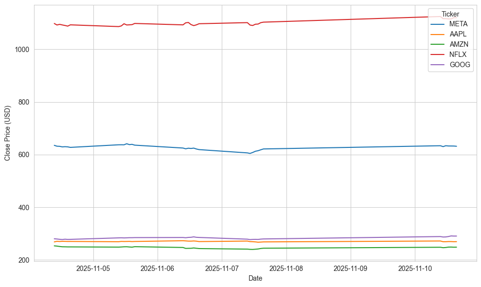

# 📘 FAANG Stock Analysis — Assessment Notebook

## 📑 Table of Contents
1. [Background](#background)
2. [Repository Setup](#repository-setup)
3. [Environment Setup](#environment-setup)
4. [Problem 1: Fetch Hourly FAANG Data](#problem-1-fetch-hourly-faang-data)
5. [Problem 2: Plotting Data](#problem-2-plotting-data)
6. [Problem 3: Script Creation](#problem-3-script-creation)
7. [Problem 4: Automation with GitHub Actions](#problem-4-automation-with-github-actions)

---

## 📚 Background

This notebook supports the [Computer Infrastructure module assessment](https://github.com/ianmcloughlin/computer-infrastructure/blob/main/assessment/problems.md) for ATU Winter 2025–2026. It focuses on collecting and visualising hourly stock data for the FAANG companies — Meta (META), Apple (AAPL), Amazon (AMZN), Netflix (NFLX), and Alphabet (GOOG) — using Python tools such as `yfinance`, `pandas`, `matplotlib`, and `seaborn`.

The project is divided into four problems:
- Problem 1: Fetch and save hourly data
- Problem 2: Plot closing prices
- Problem 3: Convert logic into a CLI script
- Problem 4: Automate execution using GitHub Actions

---

## 📥 Download Repository

To download and explore the repository:

```bash
git clone https://github.com/ECronin1973/computer_infrastructure.git
cd computer_infrastructure
```

### 📁 Included Files

- problems.ipynb — Jupyter notebook with modular steps for each problem
- faang.py — CLI script with mirrored logic from the notebook
- data/ — Folder for timestamped CSV files
- plots/ — Folder for timestamped PNG plots
- requirements.txt — Python dependencies
- .github/workflows/faang.yml — (To be created) GitHub Actions workflow

---

## 🔧 Environment Setup

To run the notebook and script successfully, choose one of the following setup options:

### 🧭 Option 1: GitHub Codespaces (Recommended)

1. Open the repository in Codespaces → GitHub → Code dropdown → Codespaces → Create codespace on main

2. Install required packages

```bash
pip install -r requirements.txt
```

3. Check file permissions

```bash
ls -l
```

4. Make scripts executable (if needed)

```bash
chmod +x faang.py
```

5. Run the notebook or script

```bash
jupyter notebook problems.ipynb
./faang.py --plot
```

📖 Reference: [GitHub Codespaces Overview](https://docs.github.com/en/codespaces/about-codespaces/what-are-codespaces)

### 🧭 Option 2: Local Python Environment

1. Install Python 3.10+ 

📖 [Installing Python — Real Python](https://realpython.com/installing-python/)

2. Create and activate a virtual environment

```bash
python -m venv venv
source venv/bin/activate  # Windows: venv\Scripts\activate
```
3. Install dependencies

```bash
pip install -r requirements.txt
```

4. Make scripts executable (if needed)

```bash
chmod +x faang.py
```

5. Run the notebook or script

```bash
jupyter notebook problems.ipynb
./faang.py --plot
```
📖 References:

[Python Virtual Environments — Real Python](https://realpython.com/python-virtual-environments-a-primer/).  
*This shows how to create and manage virtual environments for Python projects.*

[chmod Command — GeeksforGeeks](https://www.geeksforgeeks.org/chmod-command-in-linux-with-examples/).  *This explains how to use the chmod command to change file permissions in Unix-like operating systems.*

---

## 📚 Background: Accessing Market Data with yfinance

This project uses [`yfinance`](https://github.com/ranaroussi/yfinance) to retrieve hourly OHLCV data from Yahoo Finance.

### Why yfinance?

- No API key required
- Supports hourly and daily intervals
- Returns pandas-compatible DataFrames
- Ideal for exploratory analysis and educational use

📖 Reference: [yfinance documentation](https://pypi.org/project/yfinance/)

> ⚠️ Note: `yfinance` is not affiliated with or endorsed by Yahoo Inc. Use it only for educational or research purposes.

---

## 🎯 Target Audience

This repository is designed for computing students and professionals with intermediate Python skills ([Real Python](https://realpython.com/intermediate-python/)). Familiarity with pandas ([docs](https://pandas.pydata.org/docs/)), matplotlib ([docs](https://matplotlib.org/stable/users/index.html)), and basic CLI usage ([Real Python CLI Guide](https://realpython.com/ref/stdlib/argparse/)) is recommended. The notebook includes environment checks, helper functions, and modular steps ([Real Python Modules](https://realpython.com/python-modules-packages/)) to support reproducibility and automation.

---

## 🧰 Helper Functions and Modular Design

This project uses a set of modular helper functions defined directly within the notebook (`problems.ipynb`) and script (`faang.py`). While these functions are not stored in a separate helper file (like `utils.py`), they are structured and reused in a way that mirrors the benefits of a modular helper module.

By adapting the logic into reusable functions within the main files, the project maintains clean separation of concerns, avoids code duplication, and supports both interactive and automated workflows — all without requiring external imports.

### 🔧 Functions Used in This Project

| Function | Purpose | Benefit | Reference |
|----------|---------|---------|-----------|
| `verify_environment(show_preview=True)` | Tests `yfinance` connectivity and optionally previews sample data. | Confirms the environment is ready before running the full workflow. | [yfinance Quickstart](https://pypi.org/project/yfinance/) |
| `fetch_hourly_history(ticker)` | Retrieves 5 days of hourly OHLCV data for a single ticker. | Provides clean, labeled data for each FAANG stock. | [yfinance.Ticker.history](https://github.com/ranaroussi/yfinance) |
| `save_hourly_data(tickers, output_dir, overwrite=False)` | Combines hourly data for multiple tickers and saves it to a timestamped CSV. | Enables reproducibility and version control of data outputs. | [pandas.DataFrame.to_csv](https://pandas.pydata.org/pandas-docs/stable/reference/api/pandas.DataFrame.to_csv.html) |
| `load_latest_data(tickers, folder='data', show_preview=True)` | Loads the most recent CSV and splits it into separate DataFrames per ticker. | Supports targeted analysis and plotting by company. | [pandas.read_csv](https://pandas.pydata.org/pandas-docs/stable/reference/api/pandas.read_csv.html) |

---

### 🧠 Why This Matters

Although these functions are embedded within the main files rather than extracted into a standalone helper module, they are designed with the same principles in mind:

- ✅ **Reusability** – Functions are called multiple times across notebook and script  
- ✅ **Readability** – Each function has a clear, single responsibility  
- ✅ **Maintainability** – Logic is easy to update without affecting unrelated parts  
- ✅ **Scalability** – Functions can be moved to a helper file later if needed

#### 📖 References:  
- [Real Python – Python Modules and Packages](https://realpython.com/python-modules-packages/)  
- [GeeksforGeeks – Python Helper Functions](https://www.geeksforgeeks.org/python-helper-functions/)  
- [Wikipedia – DRY Principle](https://en.wikipedia.org/wiki/Don%27t_repeat_yourself)

---

## 🧪 Problem 1: Fetch Hourly FAANG Data

### 🎯 Objective

Use the `yfinance` package to fetch 5 days of hourly OHLCV data for the FAANG tickers and save the results to a timestamped CSV file.

### ⚙️ Workflow

- Define and validate the FAANG ticker list
- Use `fetch_hourly_history()` to retrieve data
- Label and clean each DataFrame
- Concatenate and save to `data/YYYYMMDD-HHMMSS.csv`

### 📤 Output File

- Format: `data/YYYYMMDD-HHMMSS.csv`
- Example: `data/20251105-220824.csv`

📖 References:  
- [pandas.DataFrame.to_csv](https://pandas.pydata.org/pandas-docs/stable/reference/api/pandas.DataFrame.to_csv.html)  
- [datetime Module](https://docs.python.org/3/library/datetime.html)

---

## 📊 Problem 2: Plotting Data

### 🎯 Objective

Visualise the closing prices of all FAANG tickers using the most recent CSV file.

### ⚙️ Workflow

1. Load the latest CSV from the `data/` folder  
2. Plot the `Close` prices for each ticker using `matplotlib` and `seaborn`  
3. Add axis labels, a legend, and a UTC timestamped title  
4. Save the plot to `plots/YYYYMMDD-HHMMSS.png`

### 📤 Output File

- Format: `plots/YYYYMMDD-HHMMSS.png`
- Example: `plots/20251105-220824.png`



📖 References:  
- [matplotlib.pyplot.plot](https://matplotlib.org/stable/api/_as_gen/matplotlib.pyplot.plot.html)  
- [seaborn.set_style](https://seaborn.pydata.org/generated/seaborn.set_style.html)

---

## 🐍 Problem 3: Script Creation (`faang.py`)

### 🎯 Objective

Convert the notebook logic into a standalone Python script that can be executed from the terminal.

### 🧾 Script: `faang.py`

This script replicates the notebook logic and supports flexible execution via command-line flags.

### ✅ Features

- Fetches and saves hourly FAANG data
- Generates and saves comparative plots
- Supports CLI flags for flexible execution

### 🧩 CLI Flags

- `--plot` — Generate and save a plot after fetching data  
- `--overwrite` — Allow overwriting an existing CSV file  
- `--show` — Display the plot after saving

📖 Reference: [argparse — CLI Argument Parsing](https://docs.python.org/3/library/argparse.html)

### 🛠️ Script Design Process

- ✅ Copied modular functions from the notebook into `faang.py`  
  📖 [Modular Functions in Python](https://realpython.com/python-modules-packages/)

- ✅ Integrated `argparse` to support CLI flags  
  📖 [argparse Documentation](https://docs.python.org/3/library/argparse.html)

- ✅ Mapped notebook steps to discrete functions for clarity and reuse  
  📖 [Python Modules and Packages](https://realpython.com/python-modules-packages/)

- ✅ Added CLI flags for flexible execution in different environments

- ✅ Tested the script in both terminal and GitHub Codespaces environments

- ✅ Documented usage and functionality in this README  
  📖 [Documenting Python Code](https://realpython.com/documenting-python-code/)

---

## 🤖 Problem 4: Automation with GitHub Actions ( To Be Completed )

---