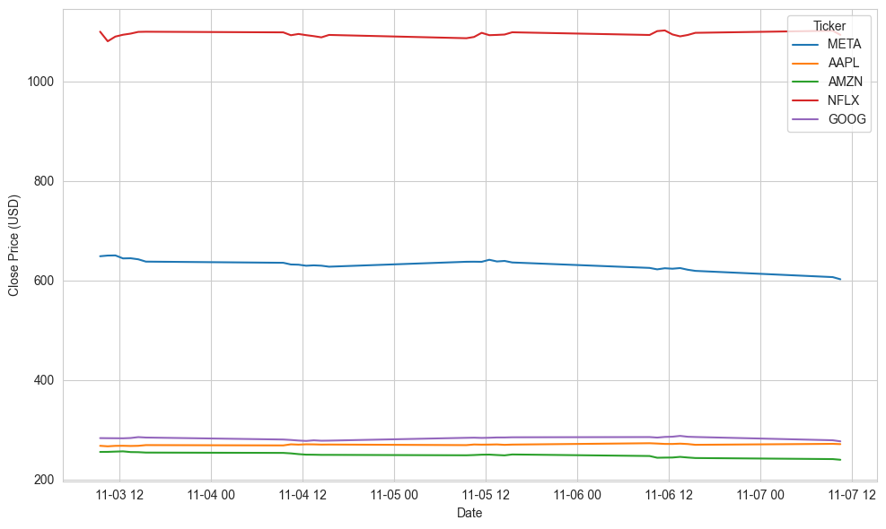

# FAANG Stock Analysis — Winter 25/26 Assessment

📈 FAANG Stock Data — Hourly Analysis
This repository provides a Jupyter notebook and supporting code for fetching, inspecting, and visualising hourly OHLCV stock data for the FAANG companies (Meta, Apple, Amazon, Netflix, and Alphabet). It is based on the [Assessment Problems](https://github.com/ianmcloughlin/computer-infrastructure/blob/main/assessment/problems.md) for the [ATU Computer Infrastructure module 2025–2026](https://vlegalwaymayo.atu.ie/course/view.php?id=13109).

## Table of Contents
- [Repository Structure](#repository-structure)
- [Download Repository](#download-repository)
- [Environment Setup Instructions](#-environment-setup-instructions)
  - [Option 1: GitHub Codespaces (Recommended for Cloud Development)](#-option-1-github-codespaces-recommended-for-cloud-development)
  - [Option 2: Local Virtual Environment (Recommended for Local Development)](#-option-2-local-virtual-environment-recommended-for-local-development) 
- [Background: Accessing Market Data with yfinance](#-background-accessing-market-data-with-yfinance)
- [Target Audience](#-target-audience)
- [Problem 1: Fetch Hourly FAANG Data](#-problem-1-fetch-hourly-faang-data)
   - [Behaviour and File Naming](#-behaviour-and-file-naming)
   - [Problem 1 OUTPUT file](#problem-1-output-file)
- [Problem 2: Plotting Data](#-problem-2-plotting-data)
   - [Problem 2 OUTPUT file](#problem-2-output-file)
- [Problem 3: Script](#-problem-3-script)
   - [How Script Was Designed](#-how-script-was-designed)

---

## Repository Structure

- `problems.ipynb` — Primary notebook, structured into modular steps for setup, data collection, loading, and plotting
- `faang.py` — Standalone CLI script that mirrors the notebook logic
- `data/` — Timestamped CSV outputs (e.g., `20251105-220824.csv`)
- `plots/` — Generated PNG visualisations (e.g., `20251105-220824.png`)
- `requirements.txt` — List of Python packages for environment setup

---

## Download Repository
To download this repository, you can use the following command in your terminal:

```bash
git clone https://github.com/ECronin1973/computer_infrastructure.git
cd computer_infrastructure
```

### Command Line Interface

**What is CLI?**

CLI (Command Line Interface) is a text-based interface where users interact with the operating system by typing commands into a terminal or console.

https://www.geeksforgeeks.org/operating-systems/difference-between-cli-and-gui/

The repository includes a command-line interface (CLI) for fetching and visualising FAANG stock data. 

You can run the notebook `problems.ipynb` using Jupyter Notebook or JupyterLab.

```bash
python problems.ipynb
```

**Run all cells sequentially to execute the data fetching and plotting steps.**

You can run the CLI script `faang.py` with the following command:

```python
python faang.py
```

## 🔧 Github Codespaces

GitHub Codespaces is a cloud-based development environment that offers a full-fledged development experience directly from your web browser or Visual Studio Code. It integrates seamlessly with GitHub.

https://www.geeksforgeeks.org/git/github-codespaces/

## 🔧 Environment Setup Instructions

To run the notebook and script successfully, choose one of the following setup options based on your development environment:

---

### 🧭 Option 1: GitHub Codespaces (Recommended for Cloud Development)

GitHub Codespaces is a cloud-hosted development environment that lets you code directly from a browser or Visual Studio Code. It’s tightly integrated with GitHub and designed to eliminate the need for local setup.

#### Steps:
1. **Open the repository in Codespaces**  
   Use the “Code” dropdown on GitHub → “Codespaces” → “Create codespace on main”.

2. **Install required packages**  
   ```bash
   pip install -r requirements.txt
   ```

3. **check notebook / script permissions**
```bash
ls -l
```

4. **Run the script to add executable permissions (if required)**
```bash
chmod +x faang.py
or
chmod +x problems.ipynb
```

5. **Run the notebook or script**
```bash
jupyter notebook problems.ipynb
```
or
```bash
./faang.py
```

**💡 Codespaces uses Linux-based terminals, so chmod and ./scriptname work as expected.**

📖 Reference: [GitHub Codespaces Overview](https://docs.github.com/en/codespaces/about-codespaces/what-are-codespaces)


### 🧪 Option 2: Local Virtual Environment (Recommended for Local Development)

A virtual environment isolates your Python dependencies per project. This avoids conflicts and keeps your global Python installation clean.

Steps:
1. Install Python 3.10+ Make sure Python is installed and available in your system path. 

📖 Reference: [Installing Python — Real Python](https://realpython.com/installing-python/)

2. Create and activate a virtual environment
```bash
python -m venv venv
source venv/bin/activate  # On Windows use `venv\Scripts\activate`
```

3. Install required packages
```bash
pip install -r requirements.txt
```

4. **Run the script to add executable permissions (if required)**
```bash
chmod +x faang.py
or
chmod +x problems.ipynb
```

5. **Run the notebook or script**
```bash
jupyter notebook problems.ipynb
```
or
```bash
./faang.py
```

📖 Reference: [Python Virtual Environments — Real Python](https://realpython.com/python-virtual-environments/) 

📖 Reference: [chmod Command — GeeksforGeeks](https://www.geeksforgeeks.org/chmod-command-linux-examples/)

---


### 📚 Background: Accessing Market Data with yfinance

This project uses [`yfinance`](https://github.com/ranaroussi/yfinance) to retrieve hourly OHLCV data from Yahoo Finance.

### Why yfinance?

- No API key required
- Supports hourly and daily intervals
- Returns pandas-compatible DataFrames
- Ideal for exploratory analysis and educational use

**📖 Reference:** [yfinance documentation](https://pypi.org/project/yfinance/) — Used to fetch financial data programmatically via the Yahoo Finance API.

> ⚠️ Note: `yfinance` is not affiliated with or endorsed by Yahoo Inc. Use it only for educational or research purposes.

---

## 🎯 Target Audience
This repository is designed for computing students and professionals with intermediate Python skills. Familiarity with pandas, matplotlib, and basic CLI usage is recommended. The notebook includes environment checks, helper functions, and modular steps to support reproducibility and automation.

**📖 Reference:** [Real Python — CLI Scripts](https://realpython.com/python-command-line-interfaces/) — Used to design and implement command-line flags in faang.py.

---

### 🧪 Problem 1: Fetch Hourly FAANG Data

**Objective:** Fetch hourly OHLCV data for the five FAANG tickers using the yfinance package and save the results as timestamped CSV files.

## Workflow:

- Define and validate the FAANG ticker list
- Use fetch_hourly_history() to retrieve 5 days of hourly data per ticker
- Label and clean each DataFrame
- Save combined data to a timestamped CSV file

**📖 Reference:** [pandas.DataFrame.to_csv](https://pandas.pydata.org/pandas-docs/stable/reference/api/pandas.DataFrame.to_csv.html) — Used to export structured data to CSV format for reproducibility.

**📖 Reference:** [datetime Module](https://docs.python.org/3/library/datetime.html) — Used to generate UTC timestamps for filenames and logs.

## Behaviour and File Naming

- Timestamp format (UTC) for CSVs: `YYYYMMDD-HHMMSS` (e.g., `20251105-220824.csv`)

- Default behaviour is conservative (no overwrite); toggle flags are available in the notebook to change this

- Supports both timestamped and non-timestamped filenames via configuration flags

## Problem 1 OUTPUT file

Running this notebook code will generate a CSV file in the `data/` folder with a name similar to `20251105-220824.csv`, containing the fetched hourly OHLCV data for the FAANG tickers.  Every time the notebook is run, a new timestamped CSV will be created unless the non-timestamped option is selected.

---

## 📊 Problem 2: Plotting Data

**Objective:** Visualise the closing prices of all FAANG tickers on a single plot using the most recent CSV file.

**Workflow:**

1. Load the latest CSV from the data/ folder

2. Plot the Close prices for each ticker using matplotlib and seaborn

3. Add axis labels, a legend, and a UTC timestamped title

4. Save the plot to the plots/ folder as YYYYMMDD-HHMMSS.png

**📖 Reference:** [matplotlib.pyplot.plot](https://matplotlib.org/stable/api/_as_gen/matplotlib.pyplot.plot.html) — Used to generate line plots of closing prices.

**📖 Reference:** [seaborn.set_style](https://seaborn.pydata.org/generated/seaborn.set_style.html) — Used to apply consistent visual styling across plots.

**Key Concepts:**

- Data filtering by ticker
- Plot styling and layout
- Saving plots programmatically

## Problem 2 OUTPUT file

Running this notebook code will generate a png file in the `plots/` folder with a name similar to `20251105-220824.png`, containing the fetched hourly OHLCV data for the FAANG tickers.  Every time the code section is run, a new timestamped plot image of type 'png' will be created.

example of generated plot:



---

## 🐍 Problem 3: Script

**Objective:** Convert the notebook logic into a standalone Python script (faang.py) that can be run from the command line.

**🧾 Script:** `faang.py`

This script replicates the notebook logic for use in terminal environments or CI pipelines.

**Features:**

- Fetches and saves hourly FAANG data
- Generates and saves comparative plots
- Supports CLI flags for flexible execution

**📖 Reference:** [argparse — CLI Argument Parsing](https://docs.python.org/3/library/argparse.html) — Used to implement command-line flags like --no-download, --outdir, and --no-display.

**CLI Flags:**

--no-download — Use latest CSV without fetching new data

--outdir — Specify custom output directory

--no-display — Suppress plot display (for headless execution)

**Script Features:**

- Fetches and saves hourly data using yfinance

- Generates and saves a comparative plot

### How Script Was Designed

#### Step 1: Copied modular functions from the notebook into faang.py

**Reason:**  It is essential to copy modular functions from the notebook into the script to ensure that the core logic for fetching, processing, and visualising data is preserved. This allows for code reuse and maintains consistency between the notebook and the script.
[Modular Functions in Python](https://realpython.com/python-modules-packages/) — Structuring Python Code with Modules and Packages

#### Step 2: Integrated argument parsing using argparse

**Reason**:  Integrating argument parsing allows users to customize script behaviour via command-line flags, enhancing flexibility and usability in different environments.
[Command-line argument parsing](https://docs.python.org/3/library/argparse.html) — Command-line argument parsing

#### Step 3: Mapped notebook steps to script functions

**Reason**:  Mapping notebook steps to discrete functions in the script improves code organization, readability, and maintainability. Each function encapsulates a specific task, making it easier to test and modify individual components without affecting the overall workflow.
[Mapping Functions in Python](https://realpython.com/python-modules-packages/) — Structuring Python Code with Modules and Packages

#### Step 4: Added CLI flags for flexible execution

**Reason**:  Adding CLI flags allows users to customise the script's behavior without modifying the code. This is particularly useful for adapting the script to different environments or use cases.
[CLI Argument Parsing](https://docs.python.org/3/library/argparse.html) — Command-line argument parsing

#### Step 5: Tested script in terminal and Codespaces environments

**Reason**:  Testing the script in various environments ensures its reliability and helps identify any environment-specific issues.
[Testing Scripts in Different Environments](https://realpython.com/python-modules-packages/) — Structuring Python Code with Modules and Packages

#### Step 6: Documented usage in this README

**Reason**:  Documenting usage instructions helps users understand how to run and utilise the script effectively.
[Documentation Best Practices](https://realpython.com/documenting-python-code/) — Documenting Python Code