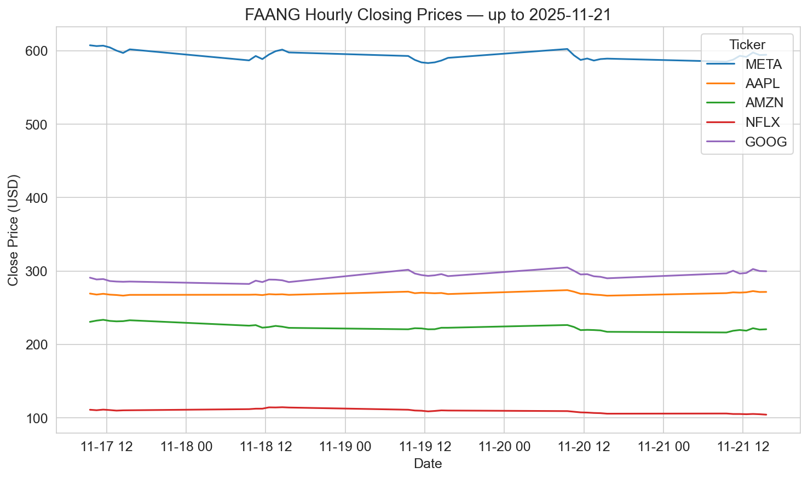

# 📘 Computer Infrastructure – FAANG Stock Analysis

This repository demonstrates reproducible workflows for FAANG stock analysis, aligned with the ATU Galway Computer Infrastructure module assessment. It provides transparent pipelines for fetching, validating, and visualising hourly FAANG data, with clear documentation and reviewer guidance.

**Author:** Edward Cronin  
**Student ID:** g00425645  
**Email:** g00425645@atu.ie  
**GitHub:** [ECronin1973](https://github.com/ECronin1973/computer_infrastructure/tree/main)  
**Module:** Higher Diploma in Data Analytics, ATU Galway (Winter 2025–2026)  

---

## 📑 Table of Contents
1. [Background](#background)
2. [Download repository](#download-repository)
3. [Target audience](#target-audience)
4. [Environment setup](#environment-setup)
5. [Included files](#included-files)
6. [Functions used in this project](#functions-used-in-this-project)
7. [Helper Functions and Modular Design](#helper-functions-and-modular-design)
8. [Problem 1: Fetch Hourly FAANG Data](#problem-1-fetch-hourly-faang-data)
9. [Problem 2: Plotting Data](#problem-2-plotting-data)
10. [Problem 3: Script Creation (`faang.py`)](#problem-3-script-creation-faangpy)
11. [Problem 4: Automation with GitHub Actions (To Be Completed)](#problem-4-automation-with-github-actions-to-be-completed)
12. [Analysis (optional)](#analysis-optional)
13. [Acknowledgements](#acknowledgements)
14. [Personal reflection](#personal-reflection)

---

### Background

This notebook supports the ATU Winter 2025–2026 Computer Infrastructure module assessment (see [assessment problems](https://github.com/ianmcloughlin/computer-infrastructure/blob/main/assessment/problems.md)).  
It implements a reproducible pipeline to collect, persist, and visualise hourly FAANG stock data for Meta (META), Apple (AAPL), Amazon (AMZN), Netflix (NFLX), and Alphabet (GOOG).

The workflow maps directly to the module’s assessment tasks:
- **Problem 1** — Fetch and save hourly FAANG data  
- **Problem 2** — Plot closing prices  
- **Problem 3** — Convert notebook logic into a CLI script  
- **Problem 4** — Automate execution with GitHub Actions  

**Notes and assumptions**  
- “5 days” refers to the last 5 trading sessions; weekends/holidays return data up to the most recent trading day.  
- Filenames are UTC timestamped and lexicographically sortable (`TICKER_YYYYMMDD-HHmmss.csv`) for deterministic “latest file” selection.  
- Helper functions and Markdown explanation blocks document design choices, runtime flags, and reviewer considerations.  

---

### Download Repository

To download and explore the repository:

```bash
git clone https://github.com/ECronin1973/computer_infrastructure.git
cd computer_infrastructure
```

After cloning, you can either:
- Run the notebook (problems.ipynb) step by step in Jupyter.
- Execute the script directly with ./faang.py to fetch data and generate plots automatically.
- outputs are automatically saved logically into data/ and plots/ folders.

### Included Files

- [problems.ipynb](https://github.com/ECronin1973/computer_infrastructure/blob/main/problems.ipynb) — Interactive notebook with modular steps for each problem
- [faang.py](https://github.com/ECronin1973/computer_infrastructure/blob/main/faang.py) — CLI script with mirrored logic from the notebook
- data/ — Folder for saved timestamped CSV files
- plots/ — Folder for saved timestamped PNG plots
- [requirements.txt](https://github.com/ECronin1973/computer_infrastructure/blob/main/requirements.txt) — Python dependencies

---

## Environment Setup

To run the notebook and script successfully, choose one of the following setup options:

### Option 1: GitHub Codespaces (Recommended)
1. Open the repository in Codespaces → GitHub → Code dropdown → Codespaces → Create codespace on main

2. Install required packages

```bash
pip install -r requirements.txt
```

3. Check file permissions

```bash
ls -l
```

4. Make scripts executable (if needed)

```bash
chmod +x faang.py
```

5. Run the notebook or script

```bash
jupyter notebook problems.ipynb
./faang.py
```

**note:** the script automatically saves CSV's and plots appropriately into data/ and plots/ folders.

📖 Reference: [GitHub Codespaces Overview](https://docs.github.com/en/codespaces/quickstart)

### Option 2: Local Python Environment

1. Install Python 3.10+ 

📖 [Installing Python — Real Python](https://realpython.com/installing-python/)

2. Create and activate a virtual environment

```bash
python -m venv venv
source venv/bin/activate  # Windows: venv\Scripts\activate
```
3. Install dependencies

```bash
pip install -r requirements.txt
```

4. Make scripts executable (if needed)

```bash
chmod +x faang.py
```

5. Run the notebook or script

```bash
jupyter notebook problems.ipynb
./faang.py
```
📖 References:

[Python Virtual Environments — Real Python](https://realpython.com/python-virtual-environments-a-primer/).  
*This shows how to create and manage virtual environments for Python projects.*

[chmod Command — GeeksforGeeks](https://www.geeksforgeeks.org/chmod-command-in-linux-with-examples/).  *This explains how to use the chmod command to change file permissions in Unix-like operating systems.*

---

## Target Audience

This repository is designed for computing students and professionals with intermediate Python skills ([Real Python](https://realpython.com/intermediate-python/)). Familiarity with pandas ([docs](https://pandas.pydata.org/docs/)), matplotlib ([docs](https://matplotlib.org/stable/users/index.html)), and basic CLI usage ([Real Python CLI Guide](https://realpython.com/ref/stdlib/argparse/)) is recommended. The notebook includes environment checks, helper functions, and modular steps ([Real Python Modules](https://realpython.com/python-modules-packages/)) to support reproducibility and automation.

**note** the notebook is designed to be **reviewer-friendly**, with clear sections, comments, and references to facilitate understanding and assessment.

---

## Helper Functions and Modular Design

This project uses a set of modular helper functions defined directly within the notebook (`problems.ipynb`) and script (`faang.py`). While these functions are not stored in a separate helper file (like `utils.py`), they are structured and reused in a way that mirrors the benefits of a modular helper module.

By adapting the logic into reusable functions within the main files, the project maintains clean separation of concerns, avoids code duplication, and supports both interactive and automated workflows — all without requiring external imports.

### Functions Used in This Project

The following helper functions are defined in the notebook (`problems.ipynb`).  
Additional functions, such as `plot_close_prices(data, output_dir)`, are implemented in the script (`faang.py`) to package the plotting logic for automation.

| Function | Purpose | Benefit | Reference |
|----------|---------|---------|-----------|
| `verify_environment(show_preview=True)` | Runs a quick connectivity check with yfinance and previews sample data. | Ensures dependencies and data access work before executing the full workflow. | [yfinance Quickstart](https://pypi.org/project/yfinance/) |
| `fetch_hourly_history(ticker)` | Retrieves 5 days of hourly OHLCV data for a single ticker. | Provides clean, labeled data for each FAANG stock. | [yfinance.Ticker.history](https://github.com/ranaroussi/yfinance) |
| `save_hourly_data(tickers, output_dir, overwrite=False)` | Fetches all tickers, concatenates them into one DataFrame, and saves a single timestamped CSV. | Guarantees reproducibility with versioned combined data files. | [pandas.DataFrame.to_csv](https://pandas.pydata.org/docs/reference/api/pandas.DataFrame.to_csv.html) |
| `load_latest_data(tickers, folder='data', show_preview=True)` | Reads the newest combined CSV and splits rows into separate DataFrames per ticker. | Supports targeted analysis and plotting by company. | [pandas.read_csv](https://pandas.pydata.org/docs/reference/api/pandas.read_csv.html) |
| `plot_data()` | Loads the latest combined CSV and plots hourly closing prices for all tickers. | Produces reviewer‑friendly PNGs saved in plots/ with timestamped filenames. | [matplotlib.pyplot](https://matplotlib.org/stable/api/pyplot_summary.html#module-matplotlib.pyplot) |
| `preview_dataframe(df)` | Prints shape, dtypes, and head of a DataFrame. | Quick inspection of structure and values for reviewers. | [pandas.DataFrame.head](https://pandas.pydata.org/docs/reference/api/pandas.DataFrame.head.html) |
| `check_missing_values(df)` | Reports missing values per column. | Confirms dataset integrity before plotting or analysis. | [pandas.DataFrame.isnull](https://pandas.pydata.org/docs/reference/api/pandas.DataFrame.isnull.html) |
| `describe_data(df)` | Generates summary statistics for numeric columns. | Provides quick insight into ranges, averages, and volatility. | [pandas.DataFrame.describe](https://pandas.pydata.org/docs/reference/api/pandas.DataFrame.describe.html) |
| `add_returns_and_rolling(df)` | Adds derived columns: percentage returns and 30‑period rolling mean. | Supports optional analysis (return histograms, boxplots, rolling averages). | [pandas.DataFrame.pct_change](https://pandas.pydata.org/docs/reference/api/pandas.DataFrame.pct_change.html) |

> ℹ️ Note: In the notebook, plotting is handled by 'plot_data()' (Step 7). In the script (faang.py), plotting is modularised into plot_close_prices(data, output_dir) for automation. Optional enrichments (returns, rolling mean, correlation heatmap) are demonstrated in later notebook steps but are not required for the core assessment tasks.

---

### Why this matters

These functions are designed for **reusability, readability, and transparency**. Their modular structure ensures reproducibility across both notebook and script, while making it easy for reviewers to see how each step fulfils the assessment requirements. Inline documentation and clear responsibilities mean the workflow can be maintained or scaled later without breaking consistency.


### References  
- [Real Python – Python Modules and Packages](https://realpython.com/python-modules-packages/)  
- [GeeksforGeeks – Python Helper Functions](https://www.geeksforgeeks.org/python-helper-functions/)  
- [Wikipedia – DRY Principle](https://en.wikipedia.org/wiki/Don%27t_repeat_yourself)  
- [pandas Documentation](https://pandas.pydata.org/docs/)  
- [matplotlib Documentation](https://matplotlib.org/stable/api/pyplot_summary.html)  
- [seaborn Documentation](https://seaborn.pydata.org)  

---

## Problem 1: Fetch Hourly FAANG Data

### Objective
Download hourly OHLCV data for META, AAPL, AMZN, NFLX, and GOOG covering the last 5 trading days, and save timestamped CSVs.

### What it does
- Uses yfinance to fetch hourly data.
- Aligns each ticker’s data with Date as datetime index.
- Saves outputs into data/ folder with filenames TICKER_YYYYMMDD-HHmmss.csv (UTC).

### Why its useful
Provides reproducible, timestamped datasets for analysis and comparison.

### Reviewer guidance
- Diagnostics print shape and time range before saving.
- Filenames are lexicographically sortable for deterministic “latest file” selection.

### References
- [yfinance.Ticker.history](https://github.com/ranaroussi/yfinance)  
- [pandas read_csv](https://pandas.pydata.org/docs/reference/api/pandas.read_csv.html)  
- [datetime Module](https://docs.python.org/3/library/datetime.html)  

---

## 📊 Problem 2: Plotting Data

### 🎯 Objective
Visualise hourly closing prices for all FAANG tickers on a single chart.

### What it does
- Loads the latest CSVs from data/.
- Plots Close series for each ticker using Matplotlib.
- Titles include last available trading date for clarity.

### Why its useful
Provides clear visual comparisons of FAANG hourly closes over the last five trading days.

### Reviewer guidance
- Saved plots are timestamped PNGs in plots/.
- Titles explicitly display the last trading session to avoid weekend/holiday ambiguity

### 📤 Output File
- **Format:** `plots/YYYYMMDD-HHMMSS.png`  
- **Example:** `plots/20251122-162358.png`  
- Each plot provides a clear visual comparison of FAANG hourly closes over the last five trading days.  



### References
- [pandas.read_csv](https://pandas.pydata.org/docs/reference/api/pandas.read_csv.html)  
- [matplotlib.pyplot.plot](https://matplotlib.org/stable/api/_as_gen/matplotlib.pyplot.plot.html)  

---

## Problem 3: Script Creation (`faang.py`)

### Objective
Convert notebook logic into a standalone Python script for repeatable execution.

### What it does
- Replicates notebook functions in faang.py.
- Supports CLI flags (--plot, --overwrite, --show).
- Saves outputs into data/ and plots/ folders with timestamped filenames.

### Why its useful
Enables reproducible automation outside Jupyter, with flexible command‑line execution 

### Reviewer guidance
- Documented usage and functionality in README.
- Tested in both terminal and GitHub Codespaces environments.

### References
- [argparse — CLI Argument Parsing](https://docs.python.org/3/library/argparse.html)
- [Python modules and packages](https://realpython.com/python-modules-packages/)

---

## Problem 4: Automation with GitHub Actions ( To Be Completed )

### Objective 
Automate execution of faang.py on a fixed cadence.

### What it does
- Provides scheduled workflow (.github/workflows/faang.yml).
- Commits updated CSVs and plots to repository.
- Produces clear, auditable commit history.

### Why it’s useful 
Ensures outputs remain fresh and reproducible without manual intervention.

### Reviewer guidance
- Workflow is conservative; runs weekly by default.
- Commit history documents updates transparently.

### References
- [GitHub Actions documentation](https://docs.github.com/en/actions)

---

### Step 8 — Extended Visualisations (Step 8a–8e)

This section introduces **optional, exploratory plots** that build on the Step 1 data dictionary and the derived `Return` and `RollingMean` columns from Step 6a. Each plot has its own short explanation cell and code cell.

- **Step 8a — Histogram + KDE of Returns**  
  *Reveals the distribution shape, tails, and outliers for each ticker; useful for spotting non‑normality and extreme intraday moves.*

- **Step 8b — Pairwise Scatterplot Matrix (Pairplot)**  
  *Visualises pairwise relationships and joint distributions between tickers’ synchronous returns; highlights non‑linear relationships and niche clusters.*

- **Step 8c — Correlation Analysis (Hourly Returns)**  
  *Summarises linear co‑movement across tickers using Pearson correlation; compact view for diversification and risk discussion.*

- **Step 8d — Cumulative Returns vs Equal‑weight FAANG**  
  *Compares compounded performance of each ticker to a simple equal‑weight FAANG benchmark; shows relative outperformance and path differences.*

- **Step 8e — Rolling Average Plots**  
  *Overlays 30‑period moving averages on hourly closes; smooths short‑term noise to reveal longer‑term trends.*

### 📝 Usage Notes
- All plots read `Close` (and `Date`) from Step 1 frames.  
- Returns are computed from prices when missing.  
- Plots are **exploratory only** and do not modify saved files.  

### References
- [pandas pct_change](https://pandas.pydata.org/docs/reference/api/pandas.core.groupby.DataFrameGroupBy.pct_change.html#pandas.core.groupby.DataFrameGroupBy.pct_change)
- [pandas rolling](https://pandas.pydata.org/docs/reference/api/pandas.DataFrame.rolling.html)
- [seaborn plotting](https://seaborn.pydata.org/)  

---

### Step 9 — Workflow Documentation

### Objective 
Summarise the notebook’s workflow and reproducibility practices.

### Workflow demonstrated
1. Fetch hourly FAANG data
2. Load and validate downloads
3. Preview and summarise datasets
4. Plot closing prices
5. Extended visualisations (returns, rolling means, histograms, boxplots, pairplots)
6. Correlation analysis on synchronous returns
7. Comparative performance vs benchmark
8. Notebook‑level documentation and references

### Reviewer guidance
- Each step documents inputs, alignment choices, and imputation.
- Diagnostics (shapes, time ranges, co‑observation counts) printed before key computations.

### References
- [pandas User Guide](https://pandas.pydata.org/docs/user_guide/index.html)
- [Matplotlib documentation](https://matplotlib.org/stable/contents.html)
- [Seaborn documentation](https://seaborn.pydata.org/)

---

### Acknowledgements

Copilot was used to assist with code generation and suggestions throughout this project.

---

### Personal Reflection

This project reinforced the importance of writing clean, concise, and reproducible code. Copilot assisted with code generation, but outputs were simplified and refined for clarity. By focusing on transparency, diagnostics, and reviewer guidance, the final workflow is both efficient and easy to understand.

